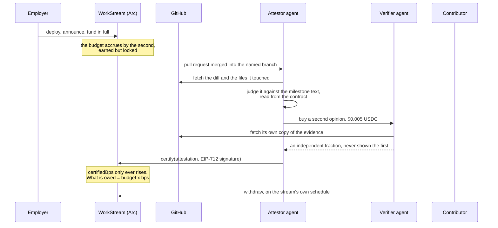
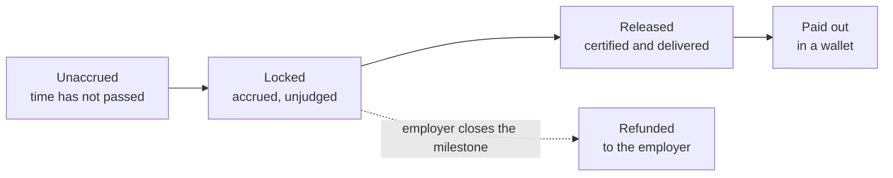

# ProofStream

USDC payroll on [Arc](https://docs.arc.network) that accrues by the second but stays
**locked** until an autonomous agent reads the actual work, judges it, and signs an
attestation certifying how much of the milestone is done. Stop shipping, and the money
pauses itself.

The attestor agent has its own wallet, forms its own opinion, and **buys an independent
second opinion from another agent** before it will move a cent. Both agents pay their own
costs. No human approves anything.

Three things are true of every payout in this repo, and each is checkable on-chain:

1. **An agent spent its own money with no human in the loop.** It paid a verifier
   $0.005, then sent the `certify` transaction from its own wallet and paid its own gas.
2. **The payment was released against a real, external signal:** a pull request diff it
   fetched itself, judged against a milestone it read from the contract.
3. **The economics only work because gas is USDC and sub-cent.** A full judge, verify,
   certify cycle costs about **one cent**, itemised [below](#what-a-cycle-actually-costs).

## Deployed on Arc Testnet (chain 5042002)

**The registry is the address that matters.** Every employer deploys their own
`WorkStream`, announces it to `StreamRegistry`, and the agent and the app find
it by reading that log, so there is no single stream address to integrate
against. The stream below is one deployed example, good for reading along on
the explorer and nothing else.

| What | Address |
| --- | --- |
| `StreamRegistry` | [`0x528B36beF91B338166F08aA41676e9f1f1BF019f`](https://testnet.arcscan.app/address/0x528B36beF91B338166F08aA41676e9f1f1BF019f) |
| Example `WorkStream` | [`0xcFfA2c4EfEC19aB6aebb484ECfF15d52449262c9`](https://testnet.arcscan.app/address/0xcFfA2c4EfEC19aB6aebb484ECfF15d52449262c9) |
| Employer / treasury | [`0xe9d2E5521573D73471497C368F3454d710170477`](https://testnet.arcscan.app/address/0xe9d2E5521573D73471497C368F3454d710170477) |
| Attestor agent (Circle developer-controlled wallet) | [`0x2CD7cc0407218f905731F88C08EEB86a94dd634A`](https://testnet.arcscan.app/address/0x2CD7cc0407218f905731F88C08EEB86a94dd634A) |
| Verifier agent (Circle developer-controlled wallet) | [`0xa7aaa2324cb141a332b22c5eac12f75b46cdeb50`](https://testnet.arcscan.app/address/0xa7aaa2324cb141a332b22c5eac12f75b46cdeb50) |
| Circle `GatewayWallet` (nanopayments) | [`0x0077777d7EBA4688BDeF3E311b846F25870A19B9`](https://testnet.arcscan.app/address/0x0077777d7EBA4688BDeF3E311b846F25870A19B9) |

`EVIDENCE.md` is generated from the chain by `pnpm evidence` and lists every transaction
these contracts have recorded, with explorer links.

## How a payout happens



1. **The employer opens a milestone** with its own budget, duration, and the repository and
   branch to watch, all on-chain.
2. **The employer deposits the budget in full.** Nothing accrues until they do.
3. **Pay accrues every second**, `budget x elapsed / duration`, earned but locked.
4. **A pull request is merged into the nominated branch.** The attestor fetches the diff
   and the milestone text itself and asks a model whether the work satisfies it, returning
   not just yes or no but *how much* it is worth. A merge into any other branch is ignored.
5. **The attestor buys a second opinion** for $0.005 over x402, paid from its own Gateway
   balance. The verifier runs a different vendor's model, fetches its own copy of the
   evidence, and never sees the attestor's answer.
6. **If both agree**, the certified share is the **lower** of the two valuations. The
   attestor signs an EIP-712 attestation and sends `certify` itself. The whole amount is
   the contributor's; the contract takes no cut.
7. **The contributor collects on the stream's schedule.** Certifying raises what is owed;
   it does not move money. **One certification keeps paying** as the clock runs, so a
   contributor who finishes a milestone never has to invent further pull requests to
   collect the rest of it.

If the attestor refuses, no fee is spent and no transaction is sent. Refusal is free.

## Three kinds of stream

Chosen at deploy and fixed for life. The same contract, the same agent, the same judgment:
what differs is who can be paid.

| Kind | Who is paid | How they are known |
| --- | --- | --- |
| **Named** | one contributor, to a wallet the employer names at deploy | an address, immutable |
| **Public** | anyone whose merge the agent accepts, each their own share | their GitHub account, hashed to an opaque id the contract stores |
| **Claimable** | one person, who binds their own wallet later | a claim signature. On-chain and unused: no link flow has been accepted |

A public stream is the interesting one. Nobody is named up front, the agent credits a
share of the milestone per accepted merge, and each earner chooses once, permanently, which
wallet is paid. The choice is authorised by an agent signature that names the payee **inside**
the signed struct, and the contract additionally requires the payee to send the transaction,
so a lifted signature is useless and a typo can never be bound.

## Where the money is, at any moment



Two numbers move independently and the gap between them is the whole design. **Certified**
is the agent's judgment and only the agent moves it. **Released** is what the stream's clock
has delivered against that judgment. Work certified today keeps arriving for as long as the
milestone runs, with no further pull requests.

## The earner's page

`/earnings` is the contributor's side. Sign in with GitHub and it shows every public stream
that has credited you; connect a wallet and it adds every named stream that pays it. One
ledger, one total, per-milestone shares, and the two actions that turn credit into money:
bind a payee once, then withdraw.

It is a phishing target by construction, so it is built in the order that makes a fake hard
to pass off: identity first, then every term of every stream read from its own contract,
before any wallet is asked for anything. It never asks for a token approval, and says so.

**No wallet is required.** A contributor with no wallet at all can create one from a passkey,
a fingerprint or face unlock held in the device's secure enclave, and Circle's paymaster
sponsors the gas. That path has been driven end to end on Arc testnet: bound, withdrawn,
and swept onward, without the earner ever holding a token first.

## Alerts

A stream page and the earnings page carry a GET UPDATES control.

- **Telegram** is open to anyone: tapping the link makes the person message the bot, so the
  chat id arrives with consent attached. They hear every judgment, and the milestone's last
  hours counted down through the grace window.
- **Email** is gated and rationed, because it costs and lands somewhere people guard. It
  reaches only a contributor the stream has credited, proved by GitHub sign-in, or the
  wallet the contract calls `employer`, proved by a signature. Accepted certifications, the
  24 and 12 hour warnings, and the grace window opening and closing, addressed by role.

## What a cycle actually costs

Measured from the agents' own ledgers and from Arc receipts, not estimated:

| Item | Cost | Paid by |
| --- | --- | --- |
| Attestor reasoning | ~$0.0002 | the agents' inference budget |
| Verifier reasoning | ~$0.0006 | the agents' inference budget |
| Second opinion | $0.005 USDC | the attestor's own wallet, on-chain |
| `certify` gas | 0.003 to 0.007 USDC | the attestor's own wallet |

Refusing costs the inference alone: no second opinion is bought when the attestor declines
on its own.

## Unsure means unpaid

The attestor returns a fraction and a confidence, and the bar rises with the claim: a
verdict asserting the whole milestone is done must clear a higher confidence than one
claiming a fifth of it. Below the bar it certifies nothing and writes its reasoning to the
ledger. The verifier can only ever lower the figure, never raise it.

A merged pull request is not a payment. It is evidence, and the agents are free to find it
insufficient.

## How the on-chain policy bounds the agent

Circle's agent-wallet spending policy is mainnet-only, and Arc is testnet, so the mandate
lives in the contract instead:

- `maxTranche` caps what one attestation may add.
- `dailyUnlockCap` caps what a UTC day may add.
- `claimCap` and `dailyClaimCap` cap what one withdrawal and one day may pay out on a
  public stream, across every earner.
- The payee is fixed, and on a named stream it can never change.
- `certifiedBps` only ever rises, and never past the whole milestone.
- The repository is locked once anything has been certified against it.

These are not claims about code that might run. A transaction that tried to certify with a
forged signature was sent and **refused on chain**:
[`0x3a76a78c…d06b88`](https://testnet.arcscan.app/tx/0x3a76a78cc90d02b4c95108a7ff17adc7ff41b29c238e97715d7d0c1b16d06b88),
`WrongSigner()`, 50,267 gas, nothing moved. `pnpm probe:policy` exercises every other guard
by simulation with a control beside each one, and `pnpm revert:prepare` prints the command
to send another.

## Only merges into the branch the employer named

A stream names `owner/name#branch`, and a merge into anything else is skipped with a reason.
Without this, a contributor can open a pull request from one throwaway branch into another,
merge it themselves, and be paid for work no employer ever reviewed: GitHub protects the
default branch and nothing else. The employer nominates the branch when creating the stream
and it is recorded on-chain.

The remaining gap is honest to state: a maintainer who can merge into the protected branch
can still merge their own work. That is the same trust the whole system already rests on,
because merging is what the employer controls.

## Can a throwaway merge top up a payout?

No, and the reason is the design rather than a filter. The fraction is **how much of the
milestone is done**, not how much this pull request is worth, and it is monotonic. Once a
milestone is certified at 60%, a trivial merge is judged against the same milestone and
scored the same 60% or lower, which cannot raise anything. Both agents have to agree, and
the second is paid to disagree.

On a public stream the same arithmetic decides the split: each certification records the
**new total**, and the difference is credited to whoever's merge caused it.

## Agent-to-agent payments settle in batches

Verification fees are paid over x402 against Circle Gateway. The buyer signs an EIP-3009
authorization off-chain, Gateway credits an internal ledger, and settlement lands on Arc
**batched**, not one transaction per call. That is the point: it is what makes sub-cent
payments viable.

So the evidence comes in two forms, and `EVIDENCE.md` keeps them apart: direct Arc
transactions with explorer links, and the seller's Gateway balance rising per call with the
transfer receipts beside it. Do not add the second to a transaction count.

## Recovering from the things that go wrong

- **A webhook that never arrived.** GitHub discards a delivery after a few retries, so the
  agent sweeps for merged pull requests with no verdict every 15 minutes and puts them
  through the same gates. Bounded: only merges after the milestone activated, only inside a
  lookback window, a few per stream per sweep, and at most three attempts each.
- **A certification the cap clipped.** When both agents agree a milestone is 97% done and
  `maxTranche` admits 30%, the contract takes 30% and the rest used to wait for a merge that
  might never come. The same sweep now climbs toward the figure the agents already concluded,
  one policy-sized step at a time, within the daily cap, without ever judging again.

## Known limitations

- **The attestor is a single trusted key.** One key signing attestations is a centralised
  oracle. The damage is bounded on-chain rather than solved: the policy caps what a
  compromised key can release, and the independent verifier is a second opinion. A
  production system would need multiple attestors and a stake to slash.
- **Both agents are operated by the same party.** The verifier is independent in
  construction, with its own wallet, process and model vendor, and it gathers its own
  evidence rather than trusting what the buyer sends. It is not independently operated.
  Production would source verifiers from an open market.
- **The model that actually ran cannot be proven.** The verifier is paid for a specific
  model and nothing today forces it to have used one. A signed receipt carrying the
  provider's generation record would make a lie *attributable*, not impossible. Real proof
  needs TEE attestation or provider-signed inference, and neither exists on commodity APIs.
- **Certification is one-way, and nobody can correct it.** `certifiedBps` only ever rises.
  This protects the contributor: an employer cannot un-approve work. The cost is that an
  over-certification, a bad judgment inside the caps or a key compromised within its daily
  allowance, is permanent and the employer has no recourse. We chose the side that protects
  the party doing the work, and this is what that choice costs.
- **The policy can be loosened but never tightened.** `raisePolicy` raises the ceilings after
  deployment; nothing lowers them and the payee can never change. A cap an employer could
  tighten mid-milestone would be a way to strand work the agent has already certified, but it
  does mean a ceiling set too high cannot be walked back without a new stream.
- **A passkey wallet is bound to this site.** It has no seed phrase and can only be driven
  from here on that device, so money left in one depends on this site existing. The earnings
  page can move any amount out of it to an address the earner names, gas sponsored, and says
  all of this before the wallet is bound.
- **The judgment is only as good as the model.** A model reading a diff can be wrong, and
  can be fooled by a sufficiently deceptive pull request. Below the confidence bar it
  releases nothing, which bounds the failure without removing it.
- **A held judgment has nowhere to go.** When the agent is not confident enough it stops and
  writes a log line. There is no review queue, no on-chain appeal and no way for a human to
  approve it afterwards; the work waits for a later pull request to be judged again.

## Install and run

Requires Node >= 22.23, pnpm, and [Foundry](https://getfoundry.sh).

```bash
pnpm install
cd contracts && forge test     # 99 contract tests
pnpm test:amounts              # decimal round-trip
pnpm check:chain               # chain id and balances
```

Every command that moves money ships with a dry run that must print ALL GREEN first:

```bash
pnpm preflight:deploy          # before deploying
pnpm preflight:register <addr> # before announcing a stream
pnpm preflight:agent           # before running the attestor
pnpm preflight:verifier        # before any agent-to-agent payment
pnpm preflight:withdraw        # before a payout
```

Running the system:

```bash
pnpm verifier:dev              # the seller, keep it up
pnpm agent:dev                 # the attestor: webhooks, sweep, alerts
pnpm web:dev                   # the web app, http://localhost:3000
pnpm logs:pull && pnpm evidence  # regenerate EVIDENCE.md from the chain
pnpm probe:policy              # prove every on-chain guard, by simulation
```

Judgment can be exercised without spending anything:

```bash
pnpm verdict:test <pr>         # what the attestor thinks
pnpm review:test <pr>          # what the verifier thinks
```

## Environment variables

Copy `.env.example` to `.env` and fill it in. It documents every variable and why it
matters. The stream's own terms, budget, duration, milestone, policy caps and payee, are
optional overrides there: they freeze on-chain at deploy, and every consumer then reads
them from the contract rather than from its own configuration.

| Variable | Purpose |
| --- | --- |
| `ARC_RPC_URL` | Arc Testnet RPC endpoint |
| `REGISTRY_ADDRESS`, `REGISTRY_DEPLOY_BLOCK` | Stream discovery. The agent serves every stream here that appointed it |
| `DEPLOYER_ADDRESS` | Employer/treasury address for read-only checks. The key is never stored here |
| `CIRCLE_API_KEY`, `ENTITY_SECRET` | Circle developer-controlled wallets. One credential pair manages both agent wallets |
| `AGENT_WALLET_ID`, `AGENT_ADDRESS`, `VERIFIER_WALLET_ID`, `VERIFIER_ADDRESS` | Written by `pnpm circle:setup` |
| `GITHUB_TOKEN`, `GITHUB_WEBHOOK_SECRET` | Reading diffs and verifying webhook signatures. The webhook secret is a **master**: each stream's own secret is derived from it |
| `GITHUB_APP_*`, `SESSION_SECRET` | The GitHub App: webhooks for every installed repository, and the connect flow for the web app |
| `AGENT_INGRESS_URL` | Public URL GitHub delivers webhooks to |
| `LLM_BASE_URL`, `LLM_API_KEY`, `AGENT_MODEL`, `VERIFIER_MODEL` | The two judges. Different vendors on purpose, and all four are required with no defaults |
| `AGENT_EVENTS_URL` | Where the web app reaches the agent: logs, payee binding, and email subscriptions |
| `RECONCILE_LOOKBACK_HOURS`, `RECONCILE_MAX_PRS`, `RECONCILE_EVERY_MINUTES` | Missed-webhook sweep bounds |
| `RESUME_CLIPPED` | Whether the sweep resumes certifications the cap clipped. `off` disables it |
| `TELEGRAM_BOT_TOKEN`, `NEXT_PUBLIC_TELEGRAM_BOT` | The alerts bot: its token for the agent, its username for the web app |
| `EMAIL_API_URL`, `EMAIL_API_KEY`, `EMAIL_FROM` | Any provider taking `{from,to,subject,text,html}` over HTTP |
| `EMAIL_DAILY_MAX`, `EMAIL_MAX_CERTIFICATIONS_PER_STREAM_PER_DAY` | Send ceilings, set under a free tier on purpose |
| `PUBLIC_APP_URL` | Where alerts send people |
| `NEXT_PUBLIC_CIRCLE_CLIENT_KEY`, `NEXT_PUBLIC_CIRCLE_CLIENT_URL` | Passkey wallets for contributors. Unset simply hides that option |
| `NEXT_PUBLIC_*` | Client-side only. Never put a secret behind this prefix |

### Bring your own model provider

Nothing here is tied to a particular vendor, and this repository does not choose one for
you. Both judges call `POST {LLM_BASE_URL}/chat/completions`, so any endpoint serving that
shape works, including one on your own machine: point it there and no inference leaves it.

`LLM_BASE_URL`, `LLM_API_KEY`, `AGENT_MODEL` and `VERIFIER_MODEL` are all **required and
have no defaults**. Set the models to slugs *that provider* serves; carrying a name over
from somewhere else is the usual failure after switching. `pnpm preflight:agent` catches it
by sending a one-token completion, so it verifies the endpoint, the key and the model name
together rather than just checking that a key exists.

Two judges from the same model is not a second opinion, so keep `AGENT_MODEL` and
`VERIFIER_MODEL` different. To split them across providers entirely, run the attestor and
the verifier with different `.env` files; they are separate processes.

## The web app

A stream is created from the employer's **own wallet**: the browser sends the deployment
transaction itself. That is not a stylistic choice. `WorkStream` records
`employer = msg.sender` in its constructor and the field is immutable, so a factory would
own every stream it minted and `closeMilestone` would refund into it permanently. Streams
then announce themselves to the registry the agent reads.

| Route | What it is |
| --- | --- |
| `/` | what the system does, for someone who has never seen it |
| `/streams` | every registered stream, no wallet required |
| `/stream/<address>` | one stream's ledger, with role-aware actions |
| `/new` | create one: choose the kind, then the terms |
| `/earnings` | the contributor's side: what you are owed, bind, withdraw |
| `/docs` | the technical reference |
| `/alerts/confirm` | where an email confirmation or unsubscribe link lands |

Every action also exists as a `pnpm` command. The UI is a second front door, never a
replacement.

## Notes on Arc

- Native gas and ERC-20 USDC are the same asset at different scales: 18 decimals via
  `eth_getBalance`, 6 via `balanceOf`. All formatting goes through `config/src/amounts.ts`,
  which has a round-trip test.
- **Multicall3 is deployed** at the canonical address, and batching reads through it is the
  difference between a 5-second page load and a 200-millisecond one.
- `eth_getLogs` is capped at 100,000 blocks per query. Every log scan here pages in 45,000
  block windows.
- Arc's USDC contract calls a blocklist precompile that local EVMs lack, so USDC calls
  cannot run inside a `forge script`. Deployment is deploy-only; funding runs through
  `cast send` against the live node.
- The public RPC rate-limits aggressively. Reads back off and retry.

## Roadmap

- **A verifier marketplace**, so the second opinion comes from an independent operator.
- **Model-provenance receipts**, signed by the verifier against the provider's generation
  record, so a false claim about which model ran is at least attributable.
- **Per-call pricing by model.** Buyers should be able to choose how many models review
  their work, and how thoroughly, with the price following that choice.
- **A way to correct an over-certification** that cannot become a way for an employer to
  walk back work they simply changed their mind about.
